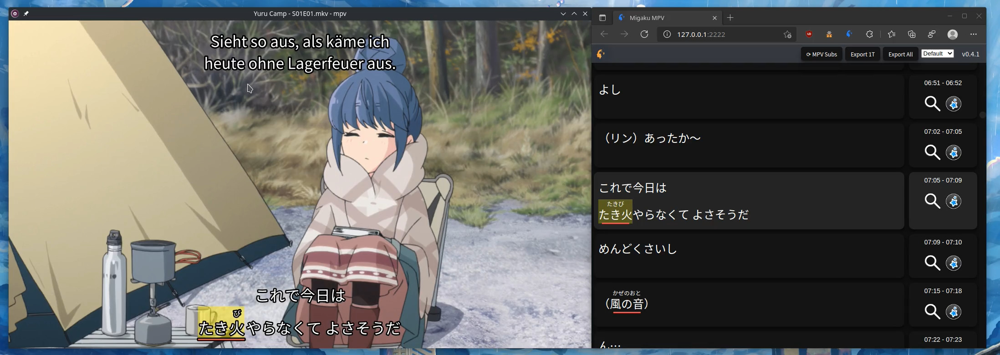

# Migaku MPV

An add-on script for the [mpv](https://mpv.io/) video player to learn languages in conjunction together with the Migaku browser extension.

# Installation

Install the latest mpv version ([Downloads](https://mpv.io/installation/)). Secondary subtitle functionality currently requires a development version of mpv.

Start it at least once to create the configuration folders.

[Download](./releases/latest) the latest release of Migaku MPV for your operating system.

Extract the `migaku_mpv` folder from the downloaded archive into the `scripts` folder of mpv.

On Linux and macOS it is located at `~/.config/mpv/scripts`. On Windows it is located at `%appdata%/mpv/scripts`. If it doesn't exist yet, create the `scripts` folder inside the ` mpv` folder.

# Usage

Open any media file and select the primary and secondary subtitles you want to use. Press `B` to open the subtitle browser.

# License

GNU General Public License v3 (See [COPYING](./COPYING))
